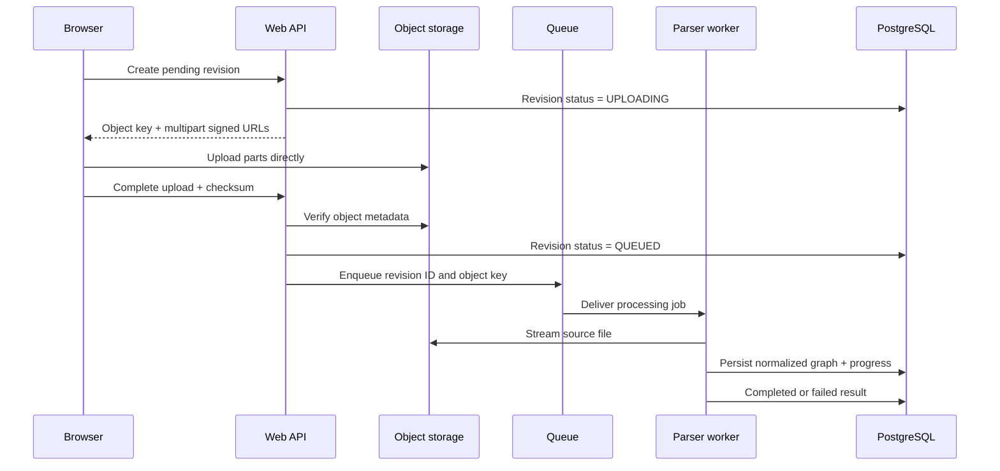

# Large File Architecture

**Status:** Approved architecture baseline  
**Target:** Secure, resumable processing of source schedule files up to 500 MB.

## 1. Principle

The original file never travels through a Next.js route or other application-server request handler. The browser sends bytes directly to private S3-compatible object storage using signed multipart upload instructions. Application services coordinate metadata, authorization, status, and asynchronous processing only.

## 2. Upload flow



## 3. Upload responsibilities

| Stage | Owner | Required behavior |
| --- | --- | --- |
| Revision creation | Web API | Verify tenant/project access; reserve revision and private object key. |
| Multipart upload | Browser + storage | Support resume, per-part retry, progress display, and final checksum. |
| Completion | Web API | Verify object exists, size limit, checksum, and expected content type before queueing. |
| Parsing | Worker | Stream the object; do not load an entire 500 MB file into memory without need. |
| Retention | Scheduled policy | Remove the original source according to organization policy without deleting normalized data. |

## 4. File-size strategy

| Source size | Upload path | Processing |
| --- | --- | --- |
| Up to 25 MB | Direct signed upload | Normal asynchronous parser job. |
| 25–100 MB | Multipart signed upload | Streamed parser job with stage progress. |
| 100–500 MB | Resumable multipart upload | Streamed parser, bounded memory, durable job lease, and retry/resume. |
| Over 500 MB | Reject in MVP with a clear message | Deferred enterprise import pipeline. |

The size threshold is enforced before signed URLs are issued where reliable metadata exists, and again after completion using object metadata.

## 5. Processing state machine

```text
QUEUED
  → UPLOADING
  → VALIDATING
  → PARSING
  → NORMALIZING
  → BUILDING_NETWORK
  → ANALYZING
  → AI_SUMMARY
  → COMPLETED

Any non-terminal stage → FAILED
FAILED → retry to last safe stage, subject to attempt limit
```

Progress reports contain stage, percentage, attempt number, timestamp, and user-safe status text. Internal error details remain in audit logs and are not exposed by default.

## 6. Queue and idempotency

A queue message contains only immutable identifiers and expected file metadata:

```json
{
  "organization_id": "uuid",
  "project_id": "uuid",
  "schedule_revision_id": "uuid",
  "object_key": "private/path",
  "checksum_sha256": "hex",
  "attempt": 1
}
```

The worker obtains a lease for the revision, checks current status and checksum, and writes results transactionally. A duplicate delivery returns the current terminal result or resumes a non-terminal job; it never creates another completed revision.

## 7. Failure handling

| Failure | System response |
| --- | --- |
| Upload interrupted | Browser resumes uploaded parts; pending revision expires after a retention window if not completed. |
| Checksum mismatch | Mark revision failed; do not enqueue processing. |
| Unsupported/corrupt format | Mark parsing failure with source-specific remediation, such as exporting Microsoft Project XML. |
| Worker crash/timeout | Lease expires; queue retries using the stored safe checkpoint. |
| Invalid dependency cycle | Persist normalized source graph, mark analysis failed or completed-with-network-error according to product policy, and emit a diagnostic. |
| Object unavailable | Retry transient storage errors; fail after attempt limit with an audit entry. |

## 8. Storage security and lifecycle

- Object keys are unguessable and organization-scoped.
- No bucket/object grants public read access.
- Upload URLs are time-limited and constrained to the intended object and content length.
- Download URLs are issued only to authorized project members.
- The source file can be retained for 7 days, 30 days, or permanently according to organization policy.
- Normalized schedule data and analysis output remain after source-file deletion.

## 9. Observability and operational limits

Record bytes uploaded, part count, checksum, parser/engine version, record counts, stage durations, retry reasons, and final error code. Alert when queue latency, processing duration, or failure rate crosses a configured operational threshold. The dashboard target remains under three seconds after processing because it queries normalized results rather than the original file.

## References

- [System Architecture](system-architecture.md)
- [PRD v1.0](../00-product/PRD-v1.0.md)
- [Universal Schedule Data Model](../02-data-model/universal-schedule-model.md)
