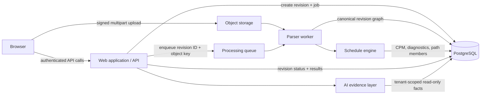

# System Architecture

**Status:** Approved architecture baseline  
**Style:** Provider-neutral modular pipeline. Supabase may provide initial authentication, PostgreSQL, and storage; each contract remains portable to equivalent managed services.

## 1. Purpose

This architecture processes large project schedules without making the web application responsible for file bytes, parsing, CPM calculation, or AI reasoning. It implements the approved immutable revision model and supports the MVP target of 500 MB per source file.

## 2. Logical architecture

## 3. Component boundaries

| Component | Responsibility | Does not do |
| --- | --- | --- |
| Browser | Select file, upload directly, display progress and revision status. | Parse files or compute schedule values. |
| Web application / API | Authentication, authorization, project workspace, signed-upload creation, revision commands, and result delivery. | Proxy original file bytes or run long parsing jobs. |
| Object storage | Store original source files by private object key and retention policy. | Expose public schedule files. |
| Processing queue | Deliver revision processing commands and enable retries. | Carry source-file content. |
| Parser worker | Validate source, select adapter, normalize to canonical revision graph, and persist source provenance. | Calculate CPM through an LLM. |
| Schedule engine | Validate the network, calculate CPM/float, run diagnostics, create versioned findings. | Modify the uploaded source or generate management prose. |
| PostgreSQL | Persist tenant, project, revision, graph, jobs, and analysis results. | Store source-file binaries. |
| AI evidence layer | Retrieve evidence-scoped project facts and citations for AI responses. | Mutate schedules or calculate deterministic facts. |

## 4. Core data flows

### Upload and processing

1. The browser creates a pending revision through an authorized API call.
2. The API validates project access, creates an object key, and returns multipart signed-upload instructions.
3. The browser uploads directly to object storage and reports the completed checksum.
4. The API marks the revision ready and enqueues a message containing only `organization_id`, `project_id`, `schedule_revision_id`, object key, and expected checksum.
5. The parser worker validates the object, normalizes it through a format adapter, and writes the canonical graph transactionally.
6. The schedule engine creates a versioned analysis run, validates network topology, calculates CPM and diagnostics, and records the result.
7. The revision becomes `COMPLETED` or `FAILED`; the web application exposes stage progress and structured failure information.

### Analysis and AI

The web application queries revision-scoped analysis results directly for dashboards. An AI request is converted to a structured evidence query that always includes organization, project, revision, and user context. The evidence layer returns activities, paths, findings, and citations; the LLM may explain those facts but cannot revise them.

## 5. Security and isolation

- API authorization resolves membership before returning or changing a project, revision, original-file key, or analysis result.
- Object storage objects are private. Signed URLs are short-lived, scoped to one object and one permitted operation.
- Queue messages contain identifiers, not data payloads or customer source files.
- Worker and engine database access are restricted to the required service role; all reads/writes include `organization_id`.
- Every processing action, retry, and AI evidence request is audit logged.
- The service must validate that a selected baseline revision belongs to the same project.

## 6. Reliability model

A processing job is idempotent by `schedule_revision_id` and source checksum. Retrying a transient failure may resume safe stages; it may not create a second completed canonical graph. Terminal parse, validation, or network failures retain a machine-readable error code, message, stage, and safe remediation guidance. A worker lease and heartbeat prevent two workers from completing the same revision concurrently.

## 7. Deployment topology

MVP uses one web deployment, a managed PostgreSQL database, private S3-compatible storage, a managed queue, and separately deployable Python worker/engine processes. Parsing and calculation share no runtime with browser request handling. The parser and engine may start as one worker deployment with internal module boundaries; their queue contracts remain separate so each can scale independently later.

## 8. Constraints and exclusions

- Maximum MVP source size: 500 MB.
- Target capacity: 100,000 activities and 500,000 relationships per revision.
- Original source retention is configurable and independent of normalized revision retention.
- Full microservice fragmentation, event streaming, distributed CPM, and autonomous schedule changes are deferred.
- Provider credentials, deployment configuration, and production infrastructure are intentionally not selected in this document.

## References

- [PRD v1.0](../00-product/PRD-v1.0.md)
- [Universal Schedule Data Model](../02-data-model/universal-schedule-model.md)
- [Database Schema](../02-data-model/database-schema.md)
- [Large File Architecture](large-file-architecture.md)
