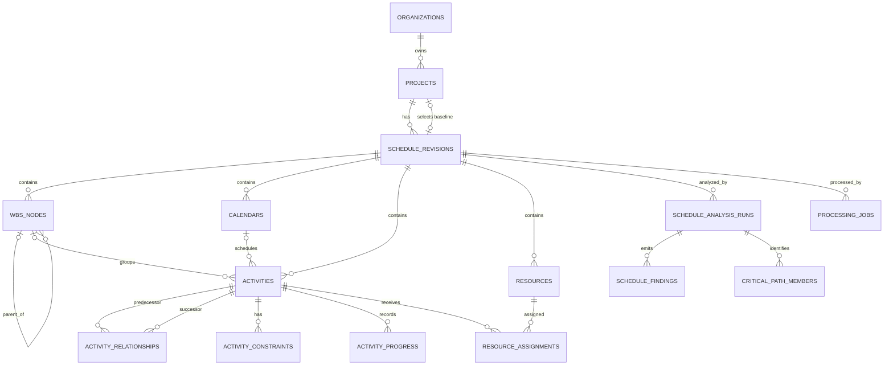

# Entity Relationship Diagram (ERD)

**Status:** Approved data-model baseline  
**Decision:** Schedule revisions are immutable snapshots. Each project may designate one revision as its approved baseline.

## Purpose

This ERD defines the normalized, multi-tenant persistence model for imported project schedules. It supports Microsoft Project, XML, Excel/CSV, and future Primavera adapters without binding the analysis engine to any one source format.

## Design rules

- Every tenant-owned record is scoped through `organization_id`.
- A source upload creates exactly one `schedule_revision`; parsed schedule content is never overwritten.
- A project chooses its baseline through `project.baseline_revision_id`, pointing to a revision of the same project.
- Analysis outputs are tied to a revision and reproducible from its normalized content.
- The CPM and rule engines calculate deterministic facts. AI stores conversations and citations, not calculated schedule truth.

## Core ERD

## Entity responsibilities

| Entity | Responsibility |
| --- | --- |
| `organizations` | Tenant boundary. |
| `projects` | Project identity, operational metadata, and the selected baseline revision. |
| `schedule_revisions` | Immutable import snapshot and source-file provenance. |
| `wbs_nodes` | Ordered WBS hierarchy within one revision. |
| `calendars` | Working-time definitions; adapter payload retained for later expansion. |
| `activities` | Canonical task, milestone, summary, and hammock representation. |
| `activity_relationships` | Directed dependency graph and lag. |
| `activity_constraints` | Constraint type and date, kept independently to support multiple source constraints. |
| `activity_progress` | Actual and forecast values as captured for a revision. |
| `resources` / `resource_assignments` | Optional resource data and activity assignments. |
| `processing_jobs` | Upload, parsing, normalization, and analysis lifecycle. |
| `schedule_analysis_runs` | Versioned deterministic analysis invocation. |
| `schedule_findings` | Rule-engine diagnostics and risk findings. |
| `critical_path_members` | Ordered membership in a calculated path or near-critical path. |

## Cardinality and integrity

- A revision belongs to one project; its `project_id` is immutable after creation.
- An activity belongs to exactly one revision and may reference one WBS node and one calendar in that revision.
- Both endpoints of a relationship must belong to the same revision.
- A baseline revision must belong to the project that selects it.
- `external_id` is unique within a revision when present; adapter row identifiers are retained separately.
- Activity, relationship, and calendar records carry source attributes to avoid data loss before a common field is modeled.

## Out of scope for this baseline

Cost loading, multiple named baselines, cross-project dependencies, and resource leveling are deferred. The model reserves extensibility without making those features prerequisites for import or CPM.
